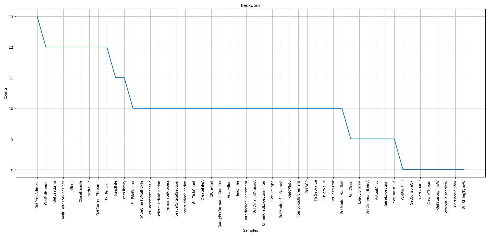
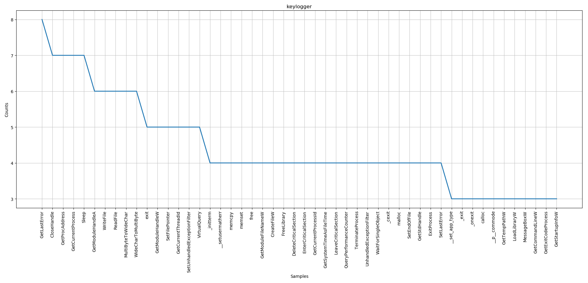
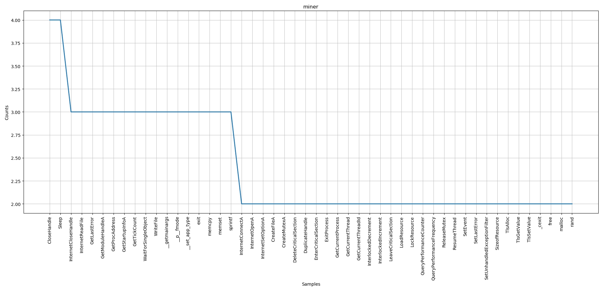
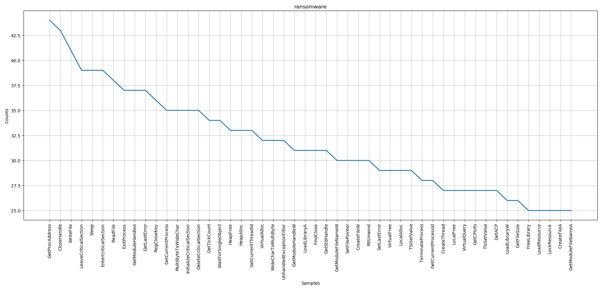
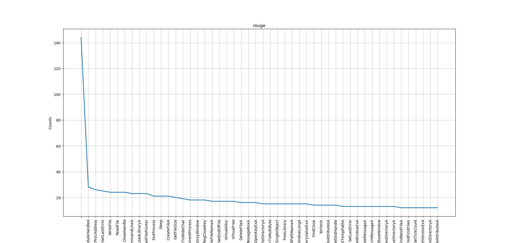
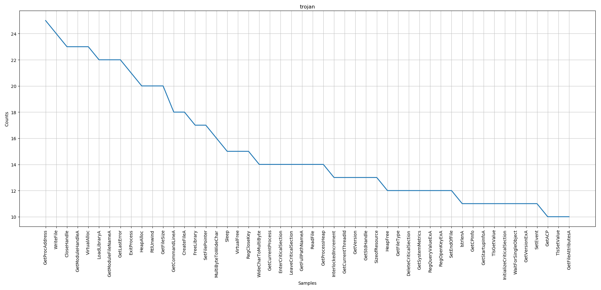
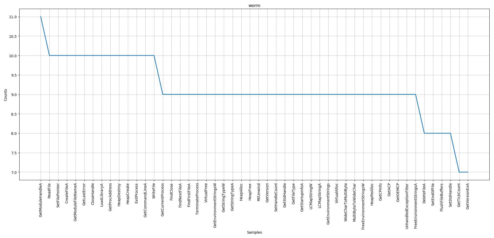
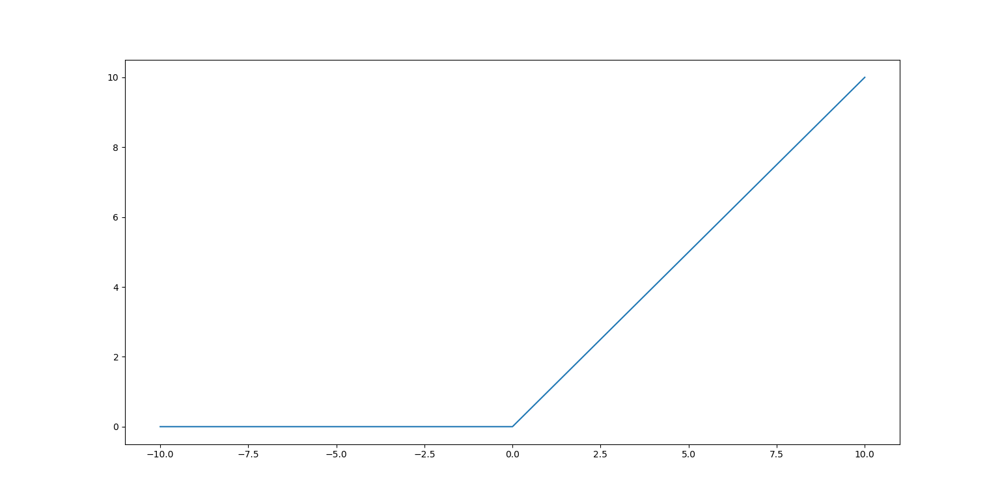
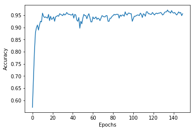
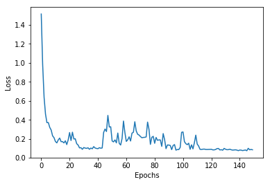

# Malware classification

This paper utilizes deep learning to classify the families of malware for Portable Executable 32 (PE32). More on paper.docx

# Sample Collection and Contribution:
Most samples are collected from various github repositories where the malware has been classified already. Thanks to VirusSign and VirusShare for providing access to huge range of malware collection. Most of the malware which is classified already and not classified is double checked by me to make sure the data is good enough to train a neural network. Current we have some samples(worm, downloader, keylogger and crypto-miner) lagging. These variants are hard to find. For example I have found about more than 300 samples of worm after analysing them, I found out they are all one single sample (Allaple) a polymorphic worm which makes copy of itself and every sample's copy is different in content as well as hash, But it is all one single worm (Allaple). This creates data duplication which affects the model badly as it relies heavily on those features. So finding unqiue worms have become highly difficult from repositories like VirusSign etc., If you ever have some of the collections kindly contribute by creating a pull request with the imports txt file alone (No EXE).

# Abstract
A malware is a computer program which harms the computer in which it gets executed. Malware analysis play a major role in analysing the functionalities and behaviour of the malware. Malware analysis is a slow and tedious process which involves a lot of manual work. Finding the type of the malware will often boost up the analysis process and helps to the researcher to know what the binary is capable of. Usually researchers perform various static analysis techniques to find the category of the malware using various tools like strings, dependency walker etc., But each day there are millions [1] of new malwares gets released classifying them manually is a non-feasible solution. So, in our approach we are going to automate this process using deep neural networks.

# I. INTRODUCTION
Malware analysis helps the researchers to find out the functionality of the malware. Malware analysis comprises of two major types,
1.	Static Malware analysis.
2.	Dynamic Malware analysis.

## Static Malware Analysis
In static malware analysis the malicious binaries are examined without executing and may be further subjected for reverse engineering using disassembler. Where as in dynamic malware analysis the malicious binary is actually executed in an isolated environment like sandbox to detect its behaviour.

## Keywords:
Windows Malware, Malware Analysis, Static Malware Analysis, Malware Classification.

## A. Types of malware:

## 1. Backdoor:
Backdoor is a malicious program which allows the remote attacker to gain access to the victim’s computer.
## 2. Downloader:
The sole purpose of the downloader is to download another malicious program and sometimes execute it.
## 3. Keylogger:
A keylogger is a program which continuously monitors the keystroke of the user. This helps the attacker to steal potential information like email address, password., etc.,
## 4. Miners:
This malicious program will use the resources of the victim’s computer to mine crypto-currency which is used to monetize the attacker’s wallet.
## 5. Rouge software:
Rouge software seems to behave like an original software say, antivirus and will trick the user to buy services which will end up paying to an attacker.
## 6. Trojan:
A trojan is a software which seems to behave like a legitimate program but does malicious activities in the background.
## 7. Ransomware:
A malicious program which encrypts the user’s files (pictures, documents, etc.,) and would demand a ransom for decryption. The ransom is generally collected through cryptocurrency like Bitcoins, Dash, etc.,

# B. Dataset Preparation:

## 1. Sample collection:
In order to prepare our dataset, we need actual malware samples. Various malware samples have been collected from open source GitHub repositories and mostly from Virus Share [2].  These repositories do already have most of the malware categorized which will be used for supervised learning. 
All the collected samples are stored in a separate directory depending on the category of the malware which helps in labelling of the malware. The collected sample’s category and their label is shown in Table 1.

#### Table 1: Malware Category with respective Label.
	+----------------+-------+
	|  Sample type   | Label |
	+----------------+-------+
	| Backdoor       |     0 |
	| Downloader     |     1 |
	| Keylogger      |     2 |
	| Miner          |     3 |
	| Ransomware     |     4 |
	| Rouge Software |     5 |
	| Trojan         |     6 |
	| Worm           |     7 |
	+----------------+-------+

## 2. Extracting Import functions:
In order to prepare our dataset, we need to extract all the Import functions used by the malware. A small C++ program is written which will extract all the imports from all the PE32 files present in the directory. MD5 hashing is used to prevent data duplication. Initially the program will create three separate files one to store the hashes of the scanned malware which is used to prevent data duplication, a separate file to store the imports used by all the executable of the same category and third file is used to notify when the PE32 has used a Packer[9] – UPX [8] which is a most widely used packer according to [14] rather than the custom packer. 
Packed program will not be used for dataset preparation however it will be used stored in a separate text file for identification. The program also creates individual files for each PE32 executables containing it’s import with the name of its hash. 
A packer is a program which encrypts the actual programs source, when the program is packed the size of the strings will be less, does have less import functions and the size of the executable is reduced too. When a packed executable is executed, the packer program runs first and will decrypt the executable to execute. Packers are also used for legitimate purposes for saving bandwidth by reducing size of the executable.
The famous and most commonly used packer is UPX which is an open source tool licensed under GPL, Capable of compressing portable executable.
Packed malware could evade the signature-based detection. For example: hash-based detection. Hash of the packed executable varies to hash of the original executable.
 
Below is the algorithm for extracting the imports,

## Algorithm 1: Import Extraction:
	for malware in directories
		if malware == scanned:
			skip
		else if malware == packed:
			append packed.txt -> malware_hash
			skip
		imports = get_all_imports(malware)
		write malware_hash.txt -> imports
		append frequency.txt -> imports
		append scanned_file.txt -> malware_hash

Here is a visualization of Imports used by various malware [Frequency Distribution Graph]:

### Backdoor:
Backdoors which gives access to the victim’s machine to the remote attacker from the graph we could see backdoor has complete access over processes, threads and file system in an infected system.
 
Noteworthy function imports in a backdoor:

	+----------------+-----------------------------------------------------------------------------------------------------------------------------------------------------------------------------------------------------------+
	| Function Name  |                                                                                                Description                                                                                                |
	+----------------+-----------------------------------------------------------------------------------------------------------------------------------------------------------------------------------------------------------+
	| CreateFile     | Creates a new file.                                                                                                                                                                                       |
	| GetProcAddress | Used to import other functions in addition to the imported functions from PE header. [15]                                                                                                                 |
	| GetTickCount   | This function takes no arguments and will return the no of milliseconds after the system has booted up. Very useful anti debugging technique to detect whether a malware is running in a virtual machine. |
	| VirtualAlloc   | Could be used for process injection. [15]                                                                                                                                                                 |
	+----------------+-----------------------------------------------------------------------------------------------------------------------------------------------------------------------------------------------------------+

*Figure 1. Frequency Distribution graph for backdoor.*

### Downloaders:
The sole purpose of the downloader is to download other malicious software as you can see it uses functions to create a new file for malware. Sleep functions makes a malware dormant for a certain specified period of time which generally slows down the dynamic malware analysis as its characters could not be analysed while it is inactive.  
Noteworthy function in downloaders:

	+---------------+--------------+----------------------------------------------------------+
	| Function Name                |    Description                                           |
	+---------------+--------------+----------------------------------------------------------+
	| •             | CreateFile   |                                                          |
	| •             | WriteFile    | Used to save the downloaded payload in victim’s machine. |
	| •             | Sleep        |                                                          |
	| •             | GetTickCount | Anti-debugging techniques.                               |
	+---------------+--------------+----------------------------------------------------------+

*Figure 2. Frequency Distribution graph for downloader.*

### Keyloggers:
Keyloggers will log the keystroke which is used to steal the user credentials. Keyboard functions are the main target in the keylogger programs.  
Noteworthy functions in keylogger:

	+---------------+----------------------+---------------------+
	| Function Name                        |Function Description |
	+---------------+----------------------+---------------------+
	| •             | ReadFile             |                     |
	| •             | WriteFile            | Used to store logs. |
	+---------------+----------------------+---------------------+

*Figure 3. Frequency Distribution graph for keyloggers.*

### Cryptocurrency Miners:
Cryptocurrency is a form a digital currency which is difficult to mine and easier to verify. Mining a crypto currency requires huge computational resources. Mining famous Crypto Currency is nowadays a highly non-profitable task in a traditional computer since the resource usage and electricity consumption will cost greater than the actual value of the currency mined. So, miners have come up with a new way of mining in a pool i.e. Each computer connected to the mining pool does a work and will be rewarded as per the good shares mined. Mining pool and cryptocurrency miners are not a malware actually but malware authors use this methodology to use a victim’s computer to mine the cryptocurrency without the knowledge of the victim. These malicious miners will use the victim’s computer resources to mine cryptocurrency which contributes to the pool of malware author. There by malware authors are profiting from it. Generally, when using a mining pool, the miner needs a constant internet connection (although it does not consume much bandwidth) to check whether the work is already done by other’s in a pool. So, we could see the higher frequency of internet related windows calls. Since many resources used to mine boosts the profit the malware tries to use as many as resources possible to increase the profit for the malware author. This can be achieved using threading and you could see the frequency of multi-threading functionality is also higher.  
Noteworthy functions used in cryptocurrency miners:

	+---------------+----------------------+----------------------------------+
	| Function Name |      Function Description                               |
	+---------------+----------------------+----------------------------------+
	| •             | GetTickCount         |                                  |
	| •             | Sleep                | Anti-debugging technique.        |
	| •             | InternetReadFile     |                                  |
	| •             | InternetOpen         | Mostly deals with HTTP requests. |
	| •             | GetCurrentThread     |                                  |
	| •             | GetCurrentThreadId   |                                  |
	| •             | ResumeThread         | Deals with threading.            |
	+---------------+----------------------+----------------------------------+

*Figure 4. Frequency Distribution graph for crypto-miners.*

### Ransomwares:
As we know ransomware is a type of malware which encrypts the user’s data i.e. files using cryptographic algorithms. Normally, not all files like DLL, EXE, SYS are affected. So, it generally scans the computer for files which is safe to encrypt like documents, pictures, etc., In the process of encrypting ransomware reads the files from the victim’s system and overwrites the data with encrypted data. We could see the frequency of “ReadFile” and “WriteFile” and some other file related windows API functions are higher.  
Noteworthy functions used by ransomwares:

	  Function Name                          Function Description                                                  
	 -------------------------------------- ----------------------------------------------- 
	                  CreateThread           Creates new thread.                                                   
	  •               ReadFile                                                              
	  •               WriteFile              Used to overwrite a file with encrypted data.  

*Figure 5. Frequency Distribution graph for ransomwares.*

### Rouge software:
These software trick or scare the users like the compute has been infected and makes the user to buy a potentially unwanted program.

*Figure 6. Frequency Distribution graph for rougue software.*

### Trojans:
Trojans are type of malware which hides its real intention to the user and makes user believe that he or she is running a legitimate program.  
Noteworthy functions used by trojans:

	  Function Name                                      Function Description                                                                              
	 ---------------- ------------------------------------------------------------------------------------------- ---------------------------------------- 
	  •                ReadFile                                                                                                                            
	  •                WriteFile                                                                                   Capable of reading and writing files.   
	  •                RegQueryValue                                                                                                                       
	  •                RegCloseKey                                                                                                                         
	  •                RegOpemKey                                                                                  Capable of accessing windows registry.  
	                   GetProcAddress                                                                              Used to import other functions in addition to the imported functions from PE header. [15]                                           

*Figure 7. Frequency Distribution graph for trojans.*

### Worms:
Worm transmits it’s copy via network, email etc., which carries malicious payload.  
Noteworthy functions used by worms:

	  Function Name   Function Description                                                                  
	 --------------- -------------------------------------------------------------------------------------- 
	  •               CreateFile                                                                            
	  •               ReadFile                                                                              
	  •               WriteFile                                                                             
	  •               FindFirstFile                                                                         
	  •               FindNextFile                                                                          
	  •               DeleteFile             Has complete access over filesystem for replicating its copy.  
	  •               GetCurrentProcess                                                                     
	  •               ExitProcess                                                                           
	  •               TerminateProcess       Has access over processes.                                     

*Figure 8. Frequency Distribution graph for worms.*

### 3. Compiling the data to dataset:

	In order to create our dataset, we need to create their headers first which is used in the identification of independent and dependent variables in supervised learning. Generally, we only need windows calls alone since many other functions varies from malware to malware. Windows function calls follow Hungarian Notation so we will remove the function calls which does not follow Hungarian Notation. One exception to removal process is Berkeley Compatible Sockets which malware mostly uses [15].  
	By now we only have individual data and yet we need to compile the data into dataset (collection of data) along the labels of the malware. The Import functions which has 1728 features is used as the column names and one additional column to include the type of the malware ranging from 0-6. To generate rows for the dataset every malware is iterated and if the Import function is present the column is marked with 1 and if not, it will be marked with the 0. The final column will be marked with the type of malware.

## Algorithm 2 – Compiling the dataset:

	import_list = []
	for frequency_file in directory:
		imports = get_imports(frequency_file)
		import_list -> append(imports)
	remove_duplicates(import_list)
	remove_unwanted_import(import_list)
	sort(import_list)
	create_column_headers(import_list)
	for malware_hash_file in directory:
		imports = get_imports(malware_hash)
		row = init_zeros(length -> header) + malware_type
		for function in imports:
			row[header.index(function)] = 1
			add_row(row)

# II. RELATED WORKS
Paper [3] the malicious binaries are actually executed in a sandboxed environment and behavioural report is generated.  
Paper [4] uses conventional and recurrent neural networks to classify malware, but executes the malware in protected environment.  The labels needed for the supervised learning has been obtained from Virus Total API.
Paper [7] used deep learning to classify benign and malicious mobile applications (Android). 202 features are extracted which includes permissions, sensitive ap calls and dynamic behaviour. The deep learning model used here is quite interesting. A semi supervised model which uses Restricted Boltzmann Machines (RBM) in pre-training phase(unsupervised) followed by regular supervised backpropagation phase.  
Paper [10] proposes a new malware classification technique based on the maximal common subgraph detection problem. 
Paper [11] Extracts various features like byte entropy, PE metadata, strings and import features. This paper uses neural networks to classify whether a file is benign or malware. The architecture of DNN has one input layer, two hidden layer and one output layer. The activation function used in the hidden layers is Parametric ReLU. The activation function used in output layer is sigmoid activation function since it is a binary classification problem.  
Paper [12] uses N-gram based signature generation for malware detection. N-grams of every file is extracted which is used to generate signatures for detection of malware.  
Paper [13] uses windows API calls from Import address table which is similar to our approach to detect zero-day malwares. This paper has tried 8 different type of classifiers KNN, NB, Neural Networks – Backpropagation, SVM Normalized Poly Kernel, SVM Poly Kernel, SVM Puk, SVM Radial Basis Function (RBM). Out of 8 SVM Normalized Poly Kernel performed so well with 98% accuracy rate and Neural Networks performed worst with about 78% accuracy rate. It is also a binary classification malware i.e. classifying whether the file is a malware or benign.   
In most of the works the malware is actually executed which slows down the entire process since only one malware can run at a particular time to generate efficient data. In our case the imports are extracted without executing the malware so labelling can be done in bulk quantities of malware. 

# III. PROPOSED SYSTEM
According to [14] the most form of malware falls under Portable Executable (PE) file format so we are proposing a system which classifies the malware which comes under portable executable file format. 

## A. Import Address Table:
Import Address Table has the information about the functions which are used by an executable. These functions could help you to identify certain functionalities of the malware.  
Here is an example of some functions used by a binary:

	•	CredFree
	•	SetSecurityDescriptorDacl
	•	InitializeSecurityDescriptor
	•	CryptDestroyKey
	•	CryptGenKey
	•	CryptEncrypt
	•	CryptImportKey
	•	CryptSetKeyParam
	•	CryptReleaseContext
	•	CommandLineToArgvW
	•	SHGetFolderPathW

As you could see some functions like CryptEncrypt will encrypt the data which exhibits the properties of ransomware. So, we could use these functions to make our predictions. Generally, an unpacked executable contains large number of Import functions but only a few Import functions contribute to the intention of the malware. We cannot write efficient conditional statements to address this issue. So, we are going to use a deep learning model to address this type of issue.

## B. Components Used to build the system:
Two main programming languages are widely used in this paper.
1.	C++ 14 – Visual Studio Compiler.
2.	64-bit Python 3.6.
Most of the import extraction, pre-processing and preparing the necessary data to compile the imports to data has been done using C++. Where Python is used for visualization and building the actual deep learning model. We have used Matplotlib for visualizing graphs and tensor board for building the architecture graph. Deep learning model is built using Keras with TensorFlow backend.  
Main tools and library used here are

		+---------------------------+--------------------------------------+
		| Jupyter Notebook          | Used to program deep learning model. |
		+---------------------------+--------------------------------------+
		| Pandas                    | To load dataset.                     |
		+---------------------------+--------------------------------------+
		| Numpy                     | For numerical processing.            |
		+---------------------------+--------------------------------------+
		| Keras [16] and TensorFlow | Deep learning libraries.             |
		+---------------------------+--------------------------------------+
		| Matplotlib                | Visualization of graphs.             |
		+---------------------------+--------------------------------------+

## Training our model:
Once the dataset has been prepared, we are ready to train our model. Our model consists of 1953 input features. The activation function used in all layer excluding the output layer is ReLU also called as Rectified Linear Unit, a non-linear activation function which takes input and gives output 0 if an input is negative else will output same input.  
Here is an ReLU output for sample input ranging from -10 to 10.

*Fig 9: Output of ReLU for -10 to 10.*  
The feed forward neural network model consists of one input layer, two hidden layers and one final output layer each using rectified linear unit as their activation function along with 20% dropout [5]. The model has been trained with 150 epochs and reached accuracy of more than 70%. We are using Adam [6] optimizer to reduce the loss function.  

## Our model’s Architecture:

The input layer takes 2238 features of import table functions encoded in a one hot encoded format. The first dense layer has 1000 units which uses bias and activation function as ReLU. 20% of dropout is applied to first dense layer. The second dense layer is similar to of first one but takes only 750 units. The third one takes 500 units and uses ReLU activation function. The final dense layer has 8 units and uses SoftMax activation function which is a commonly used activation function for multi-class classification.
 
Here is our accuracy graph after training the model for 100 epochs – 96% accuracy

And the loss for 150 epochs:

# IV. CONCLUSION:
In this research we have concluded that,
1.	Import tables play a major role in categorizing the malware.
2.	Categorizing the malware can be automated using Deep Neural Networks.
According to the statistics [1], there are millions of new malwares arising every day and executing each and every threat in a sandboxed environment and classifying them is not a feasible task. Using our system malware can be labelled in bulk quantities without even the need for executing them.  
In future this classifier will be incorporated with virus signature generation for efficient, identifiable labelling of the generated signatures. We will also add various known packers to unpack the windows PE32 files since UPX is not the only packer available. 

# References:

1.	Virus total statistics: https://www.virustotal.com/en/statistics/ 
2.	J.-M. Roberts. Virus Share. https://virusshare.com/ 
3.	K. Rieck, P. Trinius, C. Willems , T. Holz. Automatic Analysis of Malware Behaviour using Machine Learning.
4.	B. Kolosnjaji, A. Zarras, G. Webster, and C. Eckert. Deep Learning for Classification of Malware System Call Sequences.
5.	N. Srivastava, G. Hinton, A. Krizhevsky, I. Sutskever, and R. Salakhutdinov. Dropout: A Simple Way to Prevent Neural Networks from Overfitting. Journal of Machine Learning Research, 15(1):1929{1958, 2014.
6.	Kingma, Diederik P., and Jimmy Ba. "Adam: A method for stochastic optimization." arXiv preprint arXiv:1412.6980 (2014).
7.	Yuan, Zhenlong, et al. "Droid-sec: deep learning in android malware detection." ACM SIGCOMM Computer Communication Review. Vol. 44. No. 4. ACM, 2014.
8.	Oberhumer, M.F., Moln ́ar, L., Reiser, J.F.: UPX: the Ultimate Packer for eXe-cutables (2007), http://upx.sourceforge.net 
9.	Fanglu Guo, Peter Ferrie, and Tzi-cker Chiueh. A Study of the Packer Problem and Its Solutions.
10.	Park, Younghee, et al. "Fast malware classification by automated behavioral graph matching." Proceedings of the Sixth Annual Workshop on Cyber Security and Information Intelligence Research. ACM, 2010.
11.	Saxe, Joshua, and Konstantin Berlin. "Deep neural network based malware detection using two dimensional binary program features." 2015 10th International Conference on Malicious and Unwanted Software (MALWARE). IEEE, 2015.
12.	Santos, Igor, et al. "N-grams-based File Signatures for Malware Detection." ICEIS (2) 9 (2009): 317-320.
13.	Alazab, Mamoun, et al. "Zero-day malware detection based on supervised learning algorithms of API call signatures." Proceedings of the Ninth Australasian Data Mining Conference-Volume 121. Australian Computer Society, Inc., 2011.
14.	Morgenstern, Maik, and Hendrik Pilz. "Useful and useless statistics about viruses and anti-virus programs." Proceedings of the CARO Workshop. 2010.
15.	Sikorski, Michael, and Andrew Honig. Practical malware analysis: the hands-on guide to dissecting malicious software. no starch press, 2012.
16.	Chollet, François. "Keras." (2015).

